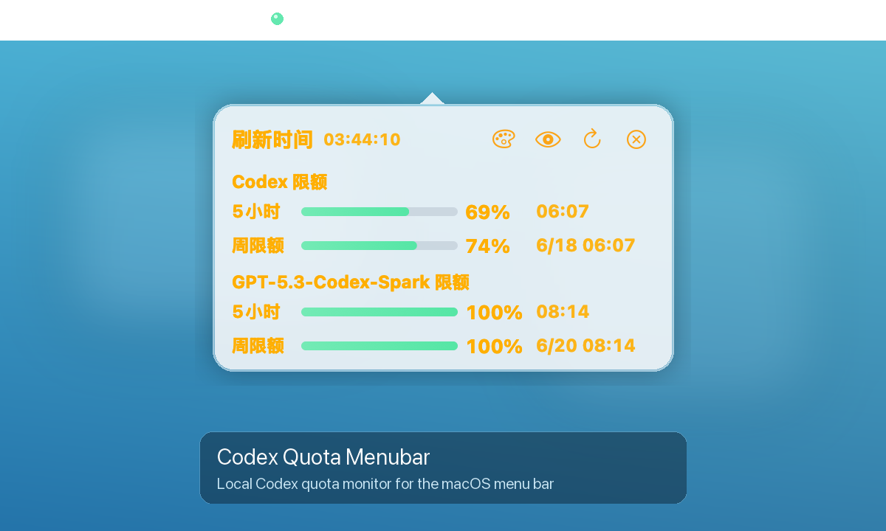

# Codex Quota Menubar

一个轻量的 macOS 菜单栏应用，用本机 Codex app-server 读取额度，并在状态栏和弹出窗口中显示剩余百分比与重置时间。



## 功能

- 状态栏实时显示 Codex 5 小时额度、重置时间
- 可选显示 `GPT-5.3-Codex-Spark` 额度
- 弹出窗口展示 5 小时额度和周限额
- 进度条使用细线渐变样式，百分比和重置时间左对齐
- 调色盘按钮可直接修改弹窗字体颜色
- 刷新时保留旧数据，新数据返回后再替换
- 不抓网页，只调用本机 Codex app-server

## 数据来源

应用启动本机 Codex app-server：

```bash
/Applications/Codex.app/Contents/Resources/codex app-server --listen stdio://
```

然后通过 JSON-RPC 请求：

```text
account/rateLimits/read
```

读取：

- 5 小时额度
- 周额度
- `usedPercent`
- `resetsAt`

剩余额度按 `100 - usedPercent` 计算。

## 使用

构建双击可运行的 `.app`：

```bash
./scripts/build-app.sh
open ".build/Codex Quota.app"
```

安装到 `/Applications`：

```bash
ditto ".build/Codex Quota.app" "/Applications/Codex Quota.app"
open "/Applications/Codex Quota.app"
```

## 开发

直接运行：

```bash
swift run CodexQuota
```

重新打包：

```bash
./scripts/build-app.sh
```

## 界面

- 绿色圆点：额度状态正常
- 灰色圆点：正在刷新
- 黄色/红色圆点：额度较低或读取失败
- 眼睛按钮：显示或隐藏 Spark 限额
- 调色盘按钮：打开系统颜色面板，修改弹窗字体颜色
- 刷新按钮：手动读取最新额度

## 要求

- macOS 13 或更高版本
- 已安装 `/Applications/Codex.app`
- Codex app-server 可正常启动
